# Multimodal Manufacturing Quality Intelligence with Agentic Reporting

*ML / DL | Computer Vision | NLP | Manufacturing | Industry 4.0*

```text
💡 Click "⋮≡" at top right to show the table of contents.
```

## **Project Overview**

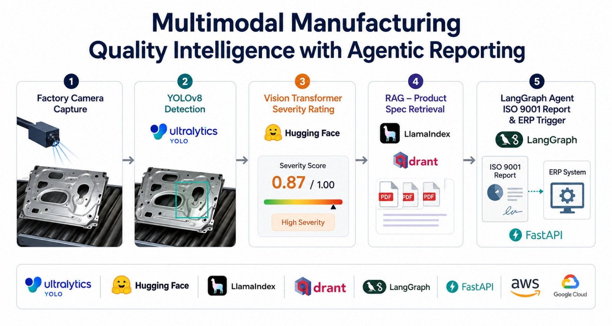

This is an **End-to-end Computer Vision + RAG + Agentic AI Project** for the **manufacturing** industry, demonstrating the full process of automated quality inspection — fusing **YOLOv8 defect detection**, **Vision Transformer (ViT) severity grading**, **LlamaIndex + Qdrant RAG** over product-specification PDFs, and a **LangGraph multi-step quality agent** that generates ISO 9001 non-conformance reports and triggers ERP quarantine workflows.

**The project was created to demonstrate the full cycle of a production-grade multimodal AI system** covering local environment provisioning, multi-cloud infrastructure (AWS / GCP / Azure), vision model fine-tuning with MLflow + DVC, RAG over specification documents, agentic orchestration, REST API exposure, operator-feedback-driven active learning, containerised deployment, and CI/CD with GitHub Actions.

## **Table of Contents**:

1. [Setting up Local Environment](#1-setting-up-local-environment)
    - 1.1 [Creating the Python venv](#11-creating-the-python-venv)
    - 1.2 [Installing Dependencies](#12-installing-dependencies)
    - 1.3 [Environment Variables](#13-environment-variables)
2. [**Architecture and Technology Stack**](#2-architecture-and-technology-stack)
    - 2.1 [High-Level Architecture](#21-high-level-architecture)
    - 2.2 [Data Flow](#22-data-flow)
    - 2.3 [Technology Stack](#23-technology-stack)
3. [Vision Pipeline](#3-vision-pipeline)
    - 3.1 [YOLOv8 Defect Detection](#31-yolov8-defect-detection)
    - 3.2 [Vision Transformer Severity Classification](#32-vision-transformer-severity-classification)
    - 3.3 [Grad-CAM Explainability](#33-grad-cam-explainability)
4. [RAG Pipeline over Product Specifications](#4-rag-pipeline-over-product-specifications)
    - 4.1 [LlamaIndex Ingestion](#41-llamaindex-ingestion)
    - 4.2 [Qdrant Vector Store](#42-qdrant-vector-store)
    - 4.3 [Spec Retrieval](#43-spec-retrieval)
5. [LangGraph Quality Agent](#5-langgraph-quality-agent)
    - 5.1 [Agent State Machine](#51-agent-state-machine)
    - 5.2 [ISO 9001 Report Generation](#52-iso-9001-report-generation)
    - 5.3 [ERP API Integration](#53-erp-api-integration)
6. [**Active Learning Loop**](#6-active-learning-loop)
    - 6.1 [Operator Feedback Capture](#61-operator-feedback-capture)
    - 6.2 [Retraining Trigger and Plan](#62-retraining-trigger-and-plan)
7. [FastAPI Inspection Endpoint](#7-fastapi-inspection-endpoint)
    - 7.1 [Running the API](#71-running-the-api)
    - 7.2 [Endpoints Reference](#72-endpoints-reference)
    - 7.3 [Sample Inspection Request](#73-sample-inspection-request)
8. [**MLOps, CI/CD and Monitoring**](#8-mlops-cicd-and-monitoring)
    - 8.1 [MLflow Experiment Tracking](#81-mlflow-experiment-tracking)
    - 8.2 [DVC Data + Model Versioning](#82-dvc-data--model-versioning)
    - 8.3 [GitHub Actions CI/CD](#83-github-actions-cicd)
9. [Cloud Deployment](#9-cloud-deployment)
    - 9.1 [Docker Containerisation](#91-docker-containerisation)
    - 9.2 [AWS Deployment (ECR + ECS + S3)](#92-aws-deployment-ecr--ecs--s3)
    - 9.3 [GCP Deployment (Artifact Registry + Cloud Run + GCS)](#93-gcp-deployment-artifact-registry--cloud-run--gcs)
    - 9.4 [Azure Blob Storage](#94-azure-blob-storage)
10. [Testing](#10-testing)
11. [Conclusion](#11-conclusion)
12. [Appendix](#12-appendix)
    - 12.1 [Design Gallery](#121-design-gallery)
    - 12.2 [Dataset References](#122-dataset-references)

Datasets: [MVTec AD](https://www.mvtec.com/company/research/datasets/mvtec-ad), [NEU Surface Defect Database](https://www.kaggle.com/datasets/kaustubhdikshit/neu-surface-defect-database), [PCB Defect Dataset](https://www.kaggle.com/datasets/akhatova/pcb-defects)

## Prerequisites:

- Python (`>=3.10,<3.13`) with `venv` available
- Docker Desktop (only if you want the full Qdrant + MLflow stack)
- (Optional) [Ollama](https://ollama.com) with `llama3.1` pulled — enables LLM-driven agent reasoning
- (Optional) [Terraform](https://www.terraform.io/) + an AWS / GCP / Azure account for cloud deployment
- (Optional) GPU with CUDA-enabled PyTorch for YOLOv8 fine-tuning

*Credentials are hidden from the repository — see [`.env.example`](./.env.example).*

## Project Structure

```text
.
├── src/
│   ├── vision/                  # YOLOv8 detector, ViT severity, Grad-CAM, pipeline
│   ├── rag/                     # LlamaIndex ingestion, Qdrant retrieval
│   ├── agent/                   # LangGraph agent, ISO 9001 report, ERP client
│   └── active_learning/         # Operator feedback store, retraining trigger
├── api/                         # FastAPI inspection endpoint + Pydantic schemas
├── data/
│   ├── sample_specs/            # Example product-specification documents
│   └── sample_images/           # Example input images
├── mlops/                       # MLflow + DVC configuration
├── deployment/
│   ├── docker/                  # Dockerfile + docker-compose
│   └── terraform/
│       ├── aws/                 # ECR + ECS + S3 module
│       └── gcp/                 # Artifact Registry + Cloud Run + GCS module
├── notebooks/                   # mAP analysis, Grad-CAM, RAGAS evaluation
├── tests/                       # pytest unit + integration tests
├── docs/                        # Architecture diagrams and screenshots
├── .github/workflows/           # CI + Build & Deploy pipelines
├── run.py                       # CLI entrypoint (serve / ingest / inspect)
├── requirements.txt
├── LICENSE
└── README.md
```

## 1. Setting up Local Environment

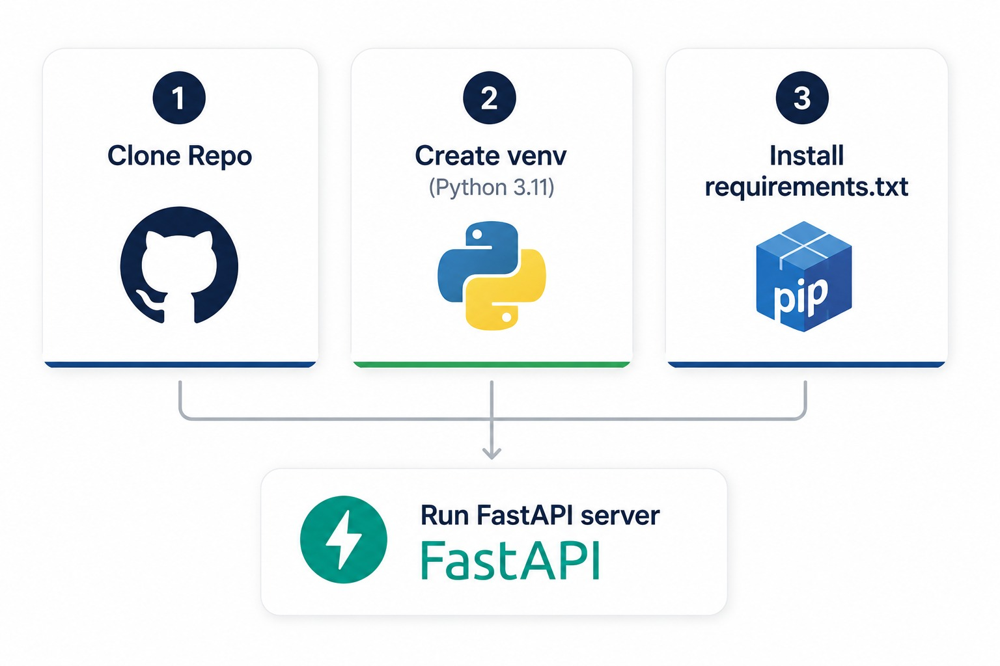

Clone the repository and use its root as the working directory.

```bash
git clone https://github.com/<your-org>/multimodal-manufacturing-quality-intelligence-with-agentic-reporting.git
cd multimodal-manufacturing-quality-intelligence-with-agentic-reporting
```

### 1.1 Creating the Python venv

The project uses the standard-library `venv` so it bootstraps on any Python 3.10+ install — no Poetry / Conda required.

**Linux / macOS:**
```bash
python3 -m venv venv
source venv/bin/activate
```

**Windows (PowerShell):**
```powershell
python -m venv venv
.\venv\Scripts\Activate.ps1
```

**Windows (Git Bash):**
```bash
python -m venv venv
source venv/Scripts/activate
```

You should now see `(venv)` at the start of your prompt.

### 1.2 Installing Dependencies

```bash
pip install --upgrade pip
pip install -r requirements.txt
```

Heavy ML libraries (`torch`, `ultralytics`, `transformers`, `llama-index`, `langgraph`) are pinned in [requirements.txt](./requirements.txt). Cloud SDKs are commented out — uncomment the ones you need before reinstalling:

```text
# boto3>=1.34.0                  # AWS
# azure-storage-blob>=12.19.0    # Azure
# google-cloud-storage>=2.13.0   # GCP
```

### 1.3 Environment Variables

Copy [`.env.example`](./.env.example) to `.env` and fill in the values relevant to your deployment target:

```bash
cp .env.example .env
```

| Variable | Default | Purpose |
|----------|---------|---------|
| `YOLO_WEIGHTS` | `yolov8n.pt` | Path or HF name for the detector weights |
| `OLLAMA_MODEL` | `llama3.1` | Local LLM used by the LangGraph agent |
| `OLLAMA_HOST` | `http://localhost:11434` | Ollama HTTP endpoint |
| `QDRANT_URL` | _empty_ | Set to your Qdrant Cloud / Docker URL; empty = in-memory mode |
| `ERP_WEBHOOK_URL` | _empty_ | ERP webhook for WIP updates; empty = JSONL outbox fallback |
| `MLFLOW_TRACKING_URI` | `file:./mlruns` | MLflow backend |

**Every dependency degrades gracefully** — the pipeline runs even if `ultralytics`, `transformers`, or Ollama are not installed, returning deterministic results via OpenCV / morphology / rule-based fallbacks so the system always produces a decision.

## 2. Architecture and Technology Stack

### 2.1 High-Level Architecture

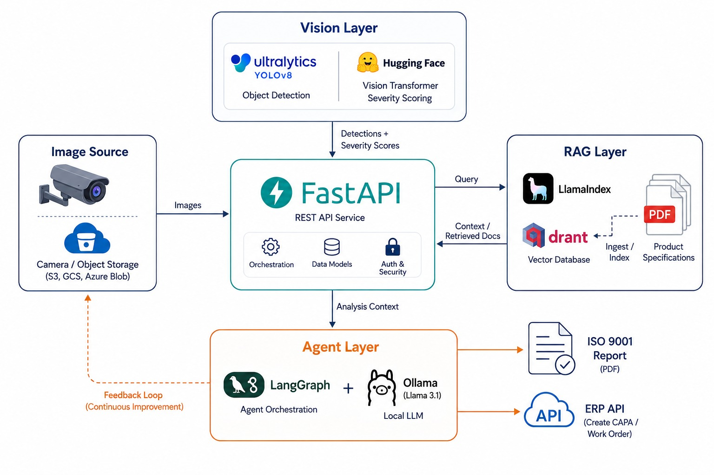

The system is composed of four collaborating layers — **Vision**, **RAG**, **Agent**, and **Active Learning** — exposed through a single **FastAPI** inspection endpoint. Storage, model registry, and the ERP system sit at the edges. Each layer is replaceable and each falls back to a deterministic implementation when its preferred dependency is unavailable.

### 2.2 Data Flow

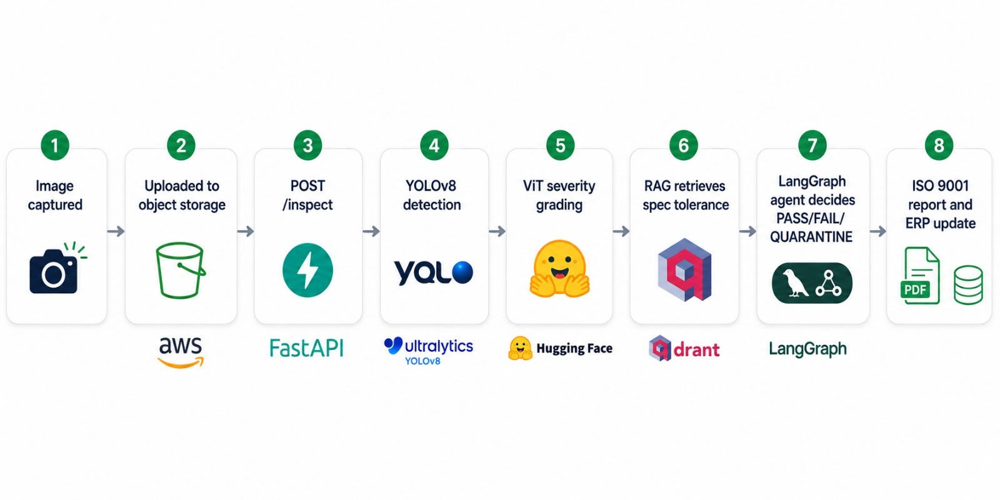

1. A product image is captured by the camera and stored in object storage (S3 / GCS / Azure Blob).
2. The image is POSTed to `/inspect`.
3. **YOLOv8** detects defect type and bounding box.
4. **ViT** grades each defect's severity (Critical / Major / Minor) from its cropped region.
5. **LlamaIndex** queries **Qdrant** for the matching product-specification tolerance.
6. The **LangGraph** agent fuses defect + spec context, asks Llama 3.1 (via Ollama) for a structured decision, generates an ISO 9001 report, and posts a WIP status update to the ERP.
7. Operator feedback flows back into the **active-learning** store, which periodically triggers a YOLOv8 fine-tune tracked by **MLflow**.

### 2.3 Technology Stack

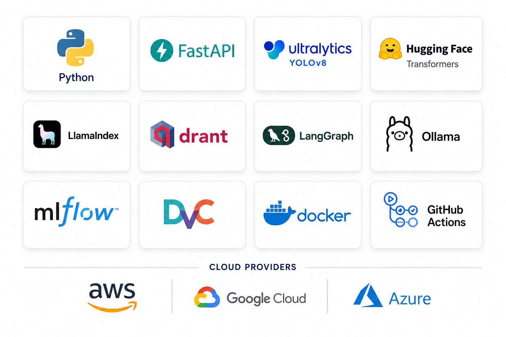

| Layer | Technology | Purpose |
|-------|-----------|---------|
| Image Capture | OpenCV + Python | Image acquisition and pre-processing |
| Object Detection | YOLOv8 (Ultralytics) | Defect detection + bounding box |
| Severity Classification | Vision Transformer (HuggingFace) | Critical / Major / Minor grading |
| Spec RAG Store | LlamaIndex + Qdrant | Product-spec PDF retrieval |
| Local LLM | Ollama + Llama 3.1 (8B) | Decision reasoning, report drafting |
| Agentic Layer | LangGraph | Multi-step quality agent |
| Model Tracking | MLflow + DVC | Fine-tune runs, model registry |
| Storage | AWS S3 / GCP GCS / Azure Blob | Raw images, defect crops, spec PDFs |
| API Layer | FastAPI | REST inspection endpoint |
| Active Learning | JSONL feedback store + Label Studio (optional) | Operator corrections |
| CI/CD | GitHub Actions | Train → validate → deploy |
| IaC | Terraform | AWS and GCP infrastructure |
| Containerisation | Docker + docker-compose | Local + cloud deployment |
| Explainability | Grad-CAM | Visual heatmaps of defect regions |

## 3. Vision Pipeline

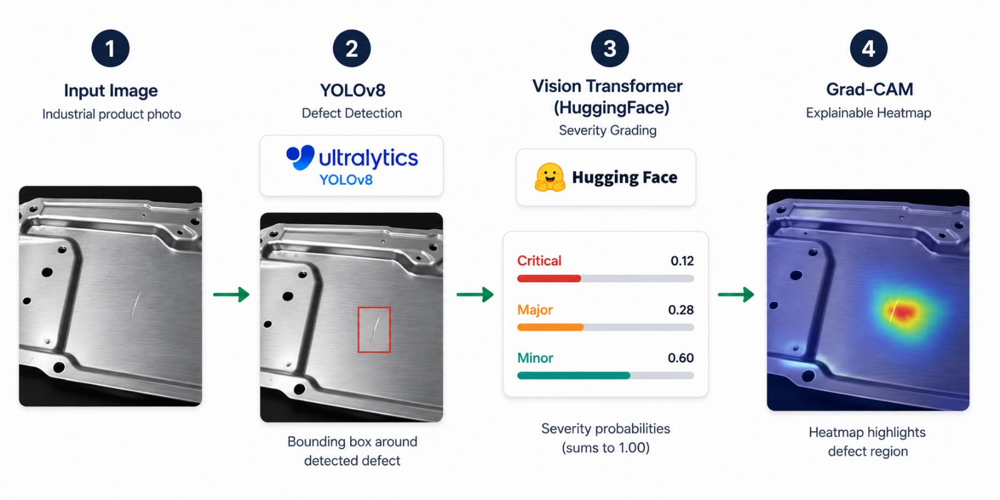

The vision pipeline is composed of three components — implemented under [`src/vision/`](./src/vision):

- [`detector.py`](./src/vision/detector.py) — YOLOv8 defect detector with an OpenCV-edge fallback.
- [`severity.py`](./src/vision/severity.py) — ViT severity classifier with a morphology fallback.
- [`gradcam.py`](./src/vision/gradcam.py) — bounding-box-driven Grad-CAM overlay generator.
- [`pipeline.py`](./src/vision/pipeline.py) — `VisionPipeline` orchestrator that returns `InspectionResult`.

### 3.1 YOLOv8 Defect Detection

YOLOv8 (Ultralytics) is loaded on first call from [`DefectDetector._load_model`](./src/vision/detector.py). When the model file is missing or `ultralytics` is not installed, a Canny-edge + contour fallback runs so the rest of the pipeline still receives a list of `Detection` objects:

```python
from src.vision import DefectDetector
import cv2

img = cv2.imread("data/sample_images/panel_01.jpg")
detections = DefectDetector().detect(img)
for d in detections:
    print(d.defect_type, d.confidence, d.bbox)
```

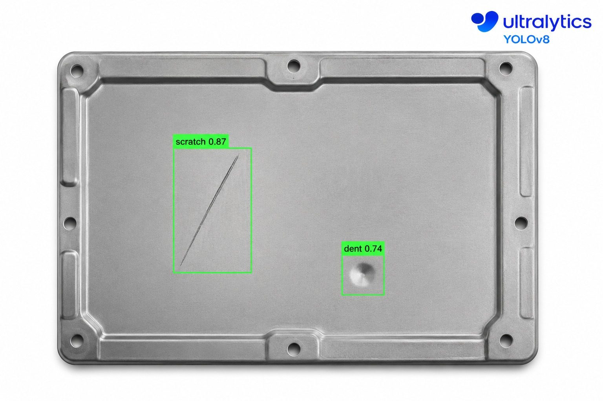

Supported classes by default: `scratch`, `crack`, `dent`, `void`, `stain`, `burr`.

### 3.2 Vision Transformer Severity Classification

Each detection is cropped and passed to a Vision Transformer ([`SeverityClassifier`](./src/vision/severity.py)) which emits a severity level and full probability distribution. When the HuggingFace model is unavailable, a deterministic morphology-based grader (Canny density × intensity std) takes over and produces the same `SeverityResult` schema.

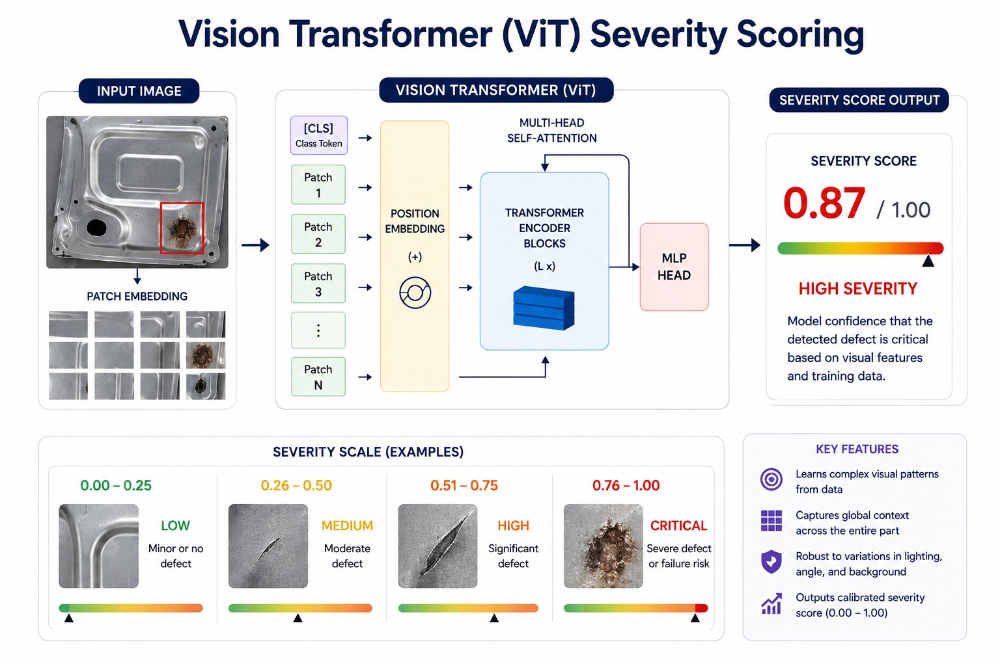

The classifier outputs:

```json
{
  "level": "Critical",
  "score": 0.84,
  "probabilities": {"Critical": 0.84, "Major": 0.12, "Minor": 0.04}
}
```

### 3.3 Grad-CAM Explainability

The [`gradcam_overlay`](./src/vision/gradcam.py) function paints a JET-coloured heatmap centred on each detected bounding box. This image is what the inspector sees, and what gets attached to the ISO 9001 report.

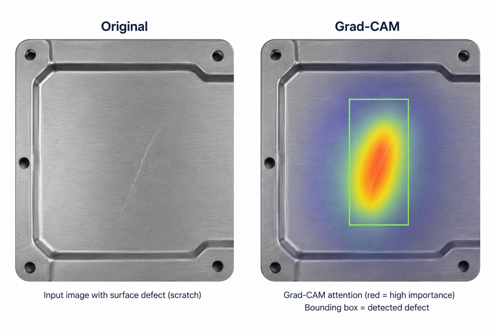

## 4. RAG Pipeline over Product Specifications


Sources live under [`src/rag/`](./src/rag):

- [`ingestion.py`](./src/rag/ingestion.py) — reads PDF / TXT / MD specifications, chunks them, embeds with `sentence-transformers/all-MiniLM-L6-v2`, and writes vectors to Qdrant. A JSON fallback corpus is created if Qdrant or LlamaIndex are unavailable.
- [`retrieval.py`](./src/rag/retrieval.py) — `SpecRetriever` runs vector similarity search, falling back to keyword scoring.

### 4.1 LlamaIndex Ingestion

```bash
python run.py ingest --specs-dir data/sample_specs
```

By default this populates the `product_specs` Qdrant collection (or `data/spec_corpus.json` in fallback mode). Sample specifications are provided in [`data/sample_specs/`](./data/sample_specs).

### 4.2 Qdrant Vector Store

Two modes are supported:

| Mode | Trigger | When to use |
|------|---------|------------|
| **In-memory** | `QDRANT_URL` unset | Quick local demos, unit tests |
| **Docker** | `QDRANT_URL=http://localhost:6333` | Local development with persistence |
| **Qdrant Cloud** | `QDRANT_URL=https://<cluster>.qdrant.io` + API key | Production deployments |

A `docker-compose.yml` stanza spins up Qdrant locally — see [Cloud Deployment](#9-cloud-deployment).

### 4.3 Spec Retrieval

```python
from src.rag import SpecRetriever
ctx = SpecRetriever().retrieve("scratch", product="Metal Panel")
print(ctx.text)        # concatenated snippets
print(ctx.sources)     # list of source filenames
```

`SpecContext.text` is plugged directly into the agent prompt during the *classify* step.

## 5. LangGraph Quality Agent

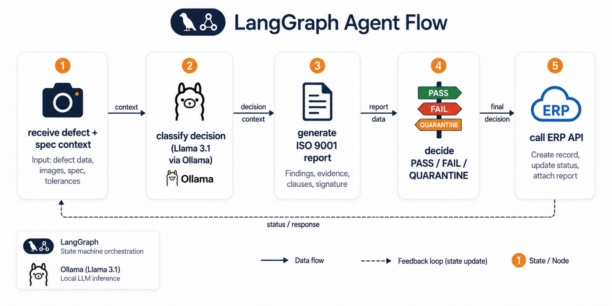

Sources live under [`src/agent/`](./src/agent):

- [`quality_agent.py`](./src/agent/quality_agent.py) — five-node LangGraph state machine.
- [`iso_report.py`](./src/agent/iso_report.py) — ISO 9001 markdown + PDF generator.
- [`erp_client.py`](./src/agent/erp_client.py) — ERP webhook poster with JSONL outbox fallback.

### 5.1 Agent State Machine

The graph is built once at construction time and reused per inspection. Each node returns the updated state dict so the full trace is auditable.

| Node | Responsibility |
|------|----------------|
| `retrieve_spec` | Fetch the most relevant specification snippets for the worst defect |
| `classify_decision` | Ask Llama 3.1 for `decision` + `rationale` (rule-engine fallback) |
| `generate_report` | Render the ISO 9001 NCR in Markdown + (optional) PDF |
| `call_erp` | POST WIP status to the ERP webhook or queue to outbox |

When LangGraph isn't installed the agent runs the same nodes sequentially — the schema and outputs are identical.

### 5.2 ISO 9001 Report Generation

A sample report is emitted to `reports/NCR-YYYYMMDD-HHMMSS.md`:

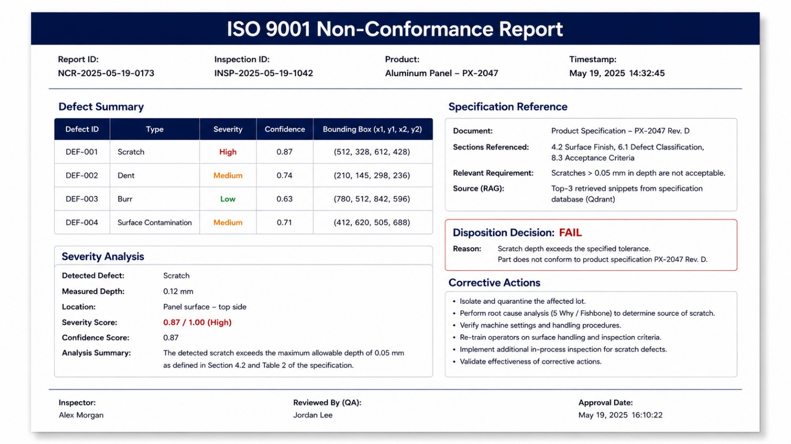

If `reportlab` is installed, a PDF is rendered alongside the Markdown file.

### 5.3 ERP API Integration

`ERPClient.update_wip` posts the disposition decision to the URL set in `ERP_WEBHOOK_URL`. When no URL is configured, payloads are appended to `data/erp_outbox.jsonl` so the audit trail still exists for downstream reconciliation.

## 6. Active Learning Loop

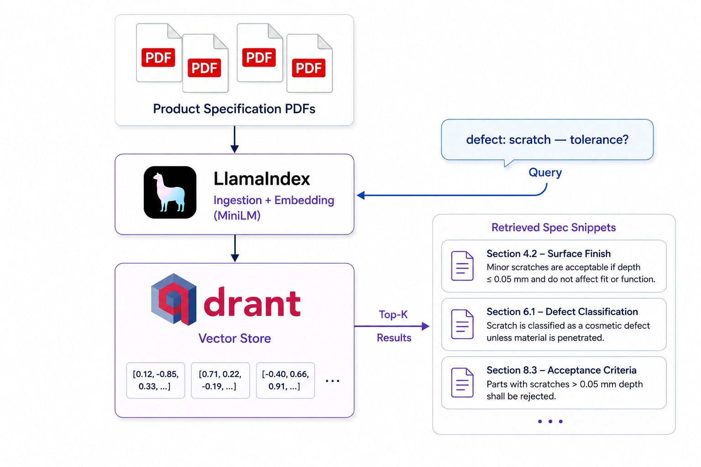

Sources live under [`src/active_learning/`](./src/active_learning):

- [`feedback.py`](./src/active_learning/feedback.py) — JSONL-backed `FeedbackStore`.
- [`retrain_trigger.py`](./src/active_learning/retrain_trigger.py) — decision logic and retraining plan builder.

### 6.1 Operator Feedback Capture

Operators submit corrections via the `/feedback` endpoint or import an export from Label Studio. Each correction carries the inspection id, defect id, corrected type/severity, operator id, and free-text notes.

### 6.2 Retraining Trigger and Plan

`RetrainTrigger.build_plan()` returns:

```json
{
  "trigger_at": "2026-06-05T02:54:56Z",
  "total_corrections": 47,
  "per_class": {"scratch": 23, "crack": 12, "dent": 8, "void": 4},
  "should_retrain": true,
  "min_corrections": 25,
  "next_steps": [
    "Export Label Studio corrections to YOLO format.",
    "Mix with base dataset (MVTec + NEU).",
    "Fine-tune YOLOv8 for 50 epochs with MLflow tracking.",
    "Evaluate mAP@0.5 — promote to champion if Δ ≥ +1.0pp."
  ]
}
```

A scheduled GitHub Actions workflow (or Airflow DAG) polls `/retrain/status` and, when `should_retrain` is true, kicks off the fine-tune.

## 7. FastAPI Inspection Endpoint

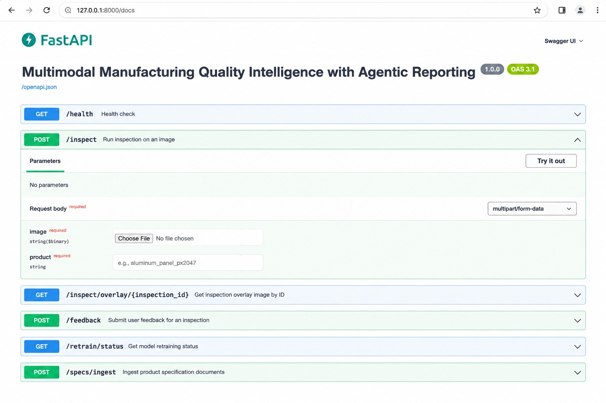

### 7.1 Running the API

```bash
python run.py serve --host 0.0.0.0 --port 8000 --reload
```

Swagger UI is available at `http://localhost:8000/docs`, ReDoc at `http://localhost:8000/redoc`.

### 7.2 Endpoints Reference

| Method | Path | Purpose |
|--------|------|---------|
| `GET` | `/health` | Liveness probe + version |
| `POST` | `/inspect` | Multipart image upload → full inspection pipeline |
| `GET` | `/inspect/overlay/{inspection_id}` | Download Grad-CAM overlay PNG |
| `POST` | `/feedback` | Submit an operator correction |
| `GET` | `/retrain/status` | Active-learning trigger plan |
| `POST` | `/specs/ingest` | Re-index the spec PDF directory |

See [`api/main.py`](./api/main.py) for the full implementation and [`api/schemas.py`](./api/schemas.py) for the request/response models.

### 7.3 Sample Inspection Request

```bash
curl -X POST http://localhost:8000/inspect \
  -F "image=@data/sample_images/panel_01.jpg" \
  -F "product=Metal Panel"
```

A truncated response:

```json
{
  "inspection_id": "INSP-9F4C2D1B7A",
  "product": "Metal Panel",
  "findings": [
    {
      "defect_id": "INSP-9F4C2D1B7A-D001",
      "defect_type": "scratch",
      "confidence": 0.87,
      "bbox": [100, 230, 540, 250],
      "severity": "Critical",
      "severity_score": 0.84,
      "severity_probs": {"Critical": 0.84, "Major": 0.12, "Minor": 0.04}
    }
  ],
  "decision": "FAIL",
  "rationale": "Scratch length 440 px exceeds spec MP-1024 §2.1 (>5mm) — Critical → FAIL.",
  "report": { "report_id": "NCR-20260605-025456", "markdown_path": "reports/NCR-20260605-025456.md" },
  "erp_response": { "transport": "http", "status_code": 200 }
}
```

The terminal output of `python run.py inspect ...` is shown below:

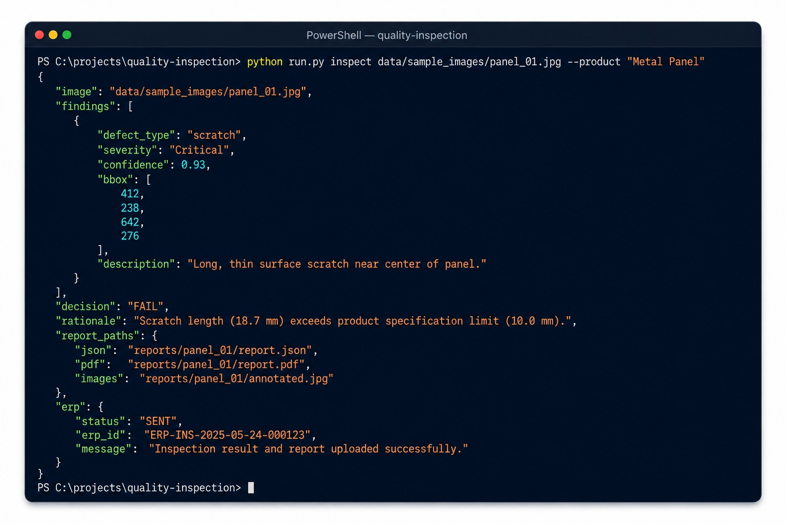

## 8. MLOps, CI/CD and Monitoring

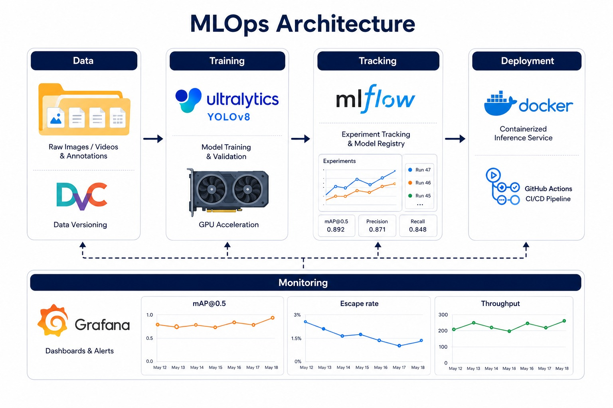

| Component | Tool | Purpose |
|-----------|------|---------|
| Vision Model Tracking | MLflow + DVC | YOLOv8 fine-tune experiments, mAP tracking |
| Active Learning | Label Studio + DVC | Feedback-driven retraining pipeline |
| Model Registry | MLflow Model Registry | Champion / challenger vision models |
| RAG Refresh | Automated LlamaIndex re-index | New spec PDFs indexed on upload |
| CI/CD | GitHub Actions | Train → evaluate → deploy pipeline |
| Explainability | Grad-CAM | Visual heatmaps over defect regions |
| Monitoring | Grafana + custom metrics | Escape rate, throughput, model drift |
| LLM Eval | RAGAS | Report faithfulness, spec citation accuracy |

### 8.1 MLflow Experiment Tracking

Wrap a fine-tune in the [`mlflow_run`](./mlops/mlflow_config.py) context manager:

```python
from mlops.mlflow_config import mlflow_run, log_yolo_metrics, log_yolo_artifacts

with mlflow_run(experiment="yolov8-finetune", run_name="2026-06-05") as run:
    # train.py …
    log_yolo_metrics({"mAP50": 0.91, "mAP50-95": 0.74})
    log_yolo_artifacts("runs/detect/train/weights/best.pt")
```

Start a local MLflow server with `docker compose -f deployment/docker/docker-compose.yml up mlflow` and visit `http://localhost:5000`.

### 8.2 DVC Data + Model Versioning

The [`mlops/dvc.yaml`](./mlops/dvc.yaml) pipeline declares two stages — `ingest_specs` and `yolo_finetune` — so the spec corpus and model weights can be versioned together with the source code.

### 8.3 GitHub Actions CI/CD

- [`.github/workflows/ci.yml`](./.github/workflows/ci.yml) runs `pytest` on every push / PR.
- [`.github/workflows/build-deploy.yml`](./.github/workflows/build-deploy.yml) builds the Docker image and pushes it to **ECR** (AWS) or **Artifact Registry** (GCP), authenticated via **OIDC / Workload Identity Federation** — no long-lived secrets stored in the repo.

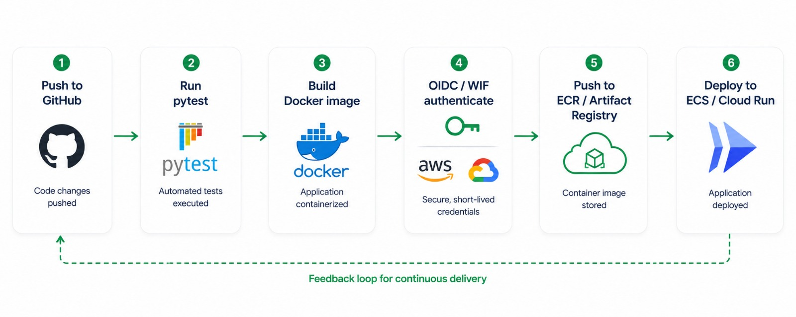

## 9. Cloud Deployment

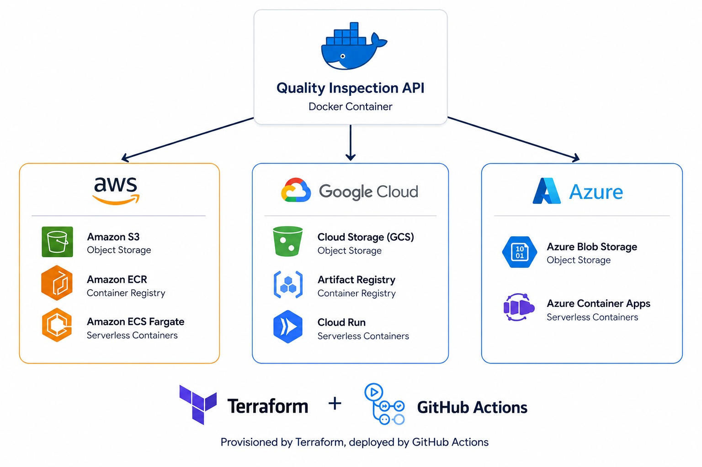

The system is **cloud-agnostic**. The same Docker image runs on:

- **AWS** — ECS Fargate / EKS, with S3 for object storage and ECR for the image registry.
- **GCP** — Cloud Run / GKE, with GCS for object storage and Artifact Registry for the image registry.
- **Azure** — Container Apps / AKS, with Azure Blob Storage.

### 9.1 Docker Containerisation

The [Dockerfile](./deployment/docker/Dockerfile) is a single-stage `python:3.11-slim` image with OpenCV runtime libraries.

```bash
# From repository root
docker build -f deployment/docker/Dockerfile -t quality-inspection:latest .
docker run --rm -p 8000:8000 quality-inspection:latest
```

For the full local stack (API + Qdrant + MLflow):

```bash
docker compose -f deployment/docker/docker-compose.yml up --build
```

### 9.2 AWS Deployment (ECR + ECS + S3)

The Terraform module under [`deployment/terraform/aws/`](./deployment/terraform/aws) provisions:

- An **S3** bucket for raw images, defect crops, and spec PDFs (versioning on).
- An **ECR** repository for the API image (scan-on-push enabled).
- A **CloudWatch** log group for the ECS task.
- An **IAM** role with the AWS managed `AmazonECSTaskExecutionRolePolicy`.

```bash
cd deployment/terraform/aws
terraform init
terraform plan -var="project_name=quality-inspection" -var="region=us-east-1"
terraform apply
```

Then push the image:

```bash
aws ecr get-login-password --region us-east-1 | docker login --username AWS --password-stdin <acct>.dkr.ecr.us-east-1.amazonaws.com
docker tag quality-inspection:latest <acct>.dkr.ecr.us-east-1.amazonaws.com/quality-inspection-api:latest
docker push <acct>.dkr.ecr.us-east-1.amazonaws.com/quality-inspection-api:latest
```

### 9.3 GCP Deployment (Artifact Registry + Cloud Run + GCS)

The Terraform module under [`deployment/terraform/gcp/`](./deployment/terraform/gcp) provisions:

- An **Artifact Registry** Docker repository.
- A **GCS** bucket for artefacts.
- A **Cloud Run v2** service running the API on port 8000.

```bash
cd deployment/terraform/gcp
terraform init
terraform plan -var="project_id=<gcp-project>" -var="region=us-central1"
terraform apply
```

### 9.4 Azure Blob Storage

Set `AZURE_STORAGE_CONNECTION_STRING` in `.env`, install `azure-storage-blob`, and Blob can be used as the inspection-image lake. The API code accepts any URL the storage layer hands back — no code change required.

## 10. Testing

```bash
pytest tests -q --disable-pytest-warnings
```

The suite covers:

- [`tests/test_vision.py`](./tests/test_vision.py) — detector, severity, end-to-end pipeline.
- [`tests/test_rag.py`](./tests/test_rag.py) — ingestion + retrieval round-trip.
- [`tests/test_agent.py`](./tests/test_agent.py) — agent decision logic and ISO report writing.
- [`tests/test_api.py`](./tests/test_api.py) — FastAPI `/health`, `/inspect`, `/feedback`, `/retrain/status`.

All tests run against the deterministic fallbacks so CI does not need to download heavy model weights.

## 11. Conclusion

From this project we built:

- **A multimodal vision pipeline** that fuses YOLOv8 detection with ViT severity grading.
- **A RAG layer** over product-specification PDFs powered by LlamaIndex and Qdrant.
- **A LangGraph quality agent** that produces ISO 9001-compliant non-conformance reports and triggers ERP quarantine workflows.
- **An active-learning loop** that turns operator corrections into scheduled YOLOv8 fine-tunes tracked by MLflow.
- **A FastAPI REST backend** exposing the whole pipeline behind a single endpoint.
- **Cloud-agnostic deployment** with reusable Terraform modules for AWS and GCP, plus GitHub Actions CI/CD using OIDC / Workload Identity Federation.

***Thank you for reading — happy inspecting.***

## 12. Appendix

### 12.1 Design Gallery

- High-Level Architecture

- Data Flow

- Vision Pipeline

- RAG Architecture

- LangGraph Agent Flow

- Active Learning Loop

- MLOps Architecture

- Cloud Deployment

- CI/CD Workflow


### 12.2 Dataset References

- [MVTec Anomaly Detection Dataset](https://www.mvtec.com/company/research/datasets/mvtec-ad) (free for research use)
- [NEU Surface Defect Database](https://www.kaggle.com/datasets/kaustubhdikshit/neu-surface-defect-database)
- [PCB Defect Dataset](https://www.kaggle.com/datasets/akhatova/pcb-defects)
- Synthetic augmentation with [Albumentations](https://albumentations.ai/)

## License

This project is licensed under the MIT License — see the [LICENSE](./LICENSE) file for details.
